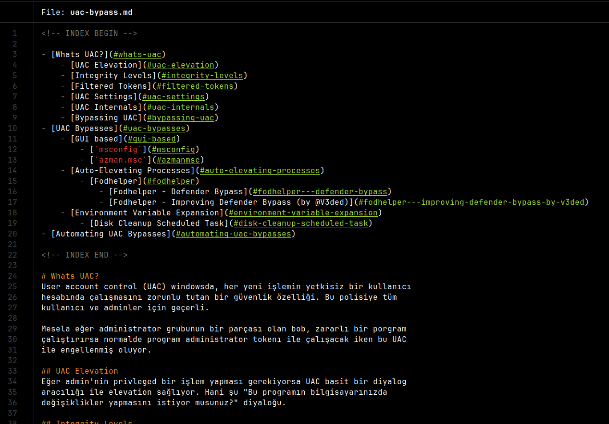

# mdindex



simple python script to create index (catalog) from markdown headers,
like the emacs org mode

## install
simply just clone the repo and run make as root to install the script
to your `PATH`:
```bash
git clone https://github.com/ngn13/mdindex.git
cd mdindex && sudo make
```

## usage
simply just specify the markdown file path, script will auto generate
the index and append it at the beginning of the file:
```bash
mdindex my/cool/notes.md
```
